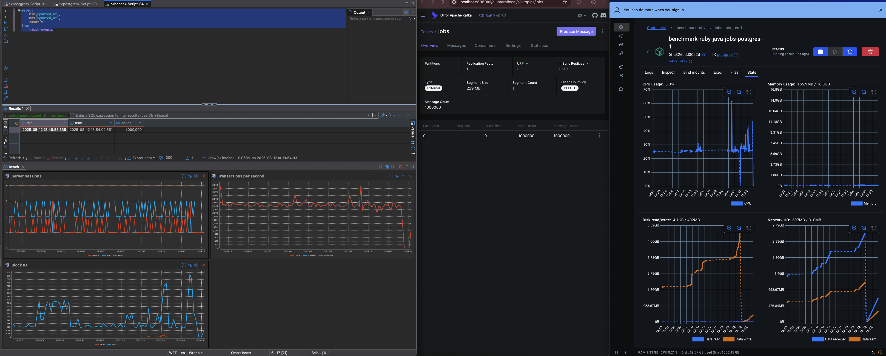
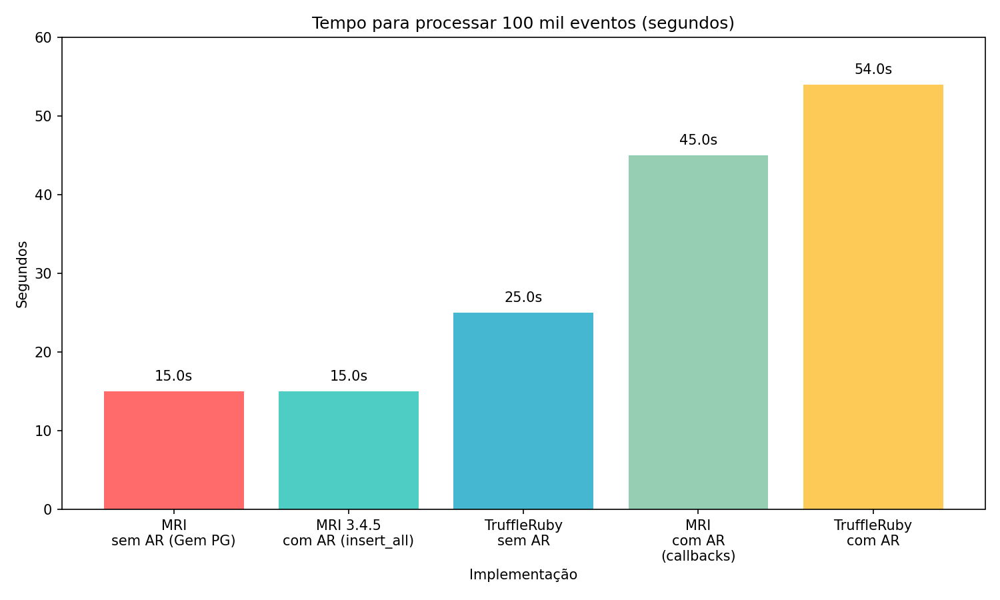

# Cenário

Uma empresa possui diversos totens de autoatendimento, e cada totem envia mensagens para um tópico Kafka. Essas mensagens são processadas por um job que popula um banco de dados Postgres.

A cada 15 minutos, cada totem envia cerca de 25 mensagens. Em um shopping, há cerca de 10 totens, então a cada 15 minutos temos aproximadamente 250 mensagens para processar.

A empresa possui 100 shoppings, então a cada 15 minutos temos cerca de 25.000 mensagens para processar, totalizando aproximadamente 100.000 mensagens por hora.

Por algum motivo, o serviço caiu por 10 horas, e as mensagens não foram processadas. Agora, o serviço foi reiniciado e está tentando processar todas as mensagens acumuladas.

Temos 1 milhão de mensagens para processar, quanto tempo levará para processar todas essas mensagens?

Eu vou tentar responder as seguintes perguntas:

- Qual é o Bottleneck? 
- O que podemos fazer para melhorar o desempenho? 

# Pendências

- [x] Comunicar Kafka, Postgres e Rails
- [x] Criar um producer de teste para enviar mensagens ao Kafka
- [x] Criar um consumer de teste com Ruby (usando MRI) para consumir mensagens do Kafka
- [x] Montar um payload para popular o banco de dados Postgres
- [x] Criar um job que consome as mensagens com o payload do cenário
- [x] Consumir os 1 milhão de mensagens do Kafka e popular o banco de dados Postgres
- [x] Limitar hardware virtual do container para ser mais justo
- [x] Após enviar 1 milhão de mensagens, continuar produzindo mensagens continuamente

# Iniciar Benchmark

## MRI (Rails)
 
```bash
docker-compose up kafka kafka-ui postgres producer setup mri --build
```


## MRI sem Rails e com Active record

```bash
docker-compose up kafka kafka-ui postgres producer mri-ar --build
```


## MRI sem Rails e sem Active record

```bash
docker-compose up kafka kafka-ui postgres producer mri-pg --build
```

## Truffleruby sem Active record

```bash
docker-compose up kafka kafka-ui postgres producer truffleruby-pg --build
```

## Truffleruby com Active record

```bash
docker-compose up kafka kafka-ui postgres producer truffleruby-ar --build
```

## Dotnet 9

```bash
docker-compose up kafka kafka-ui postgres producer truffleruby-ar --build
```

# Dicas

se quiser entrar no container do Rails, use:

```bash
docker compose run --rm -it console bash
```

Escalar workers:

```
docker compose --profile worker up -d --scale mri-worker=12
```


## Usando o Swarm

```
docker swarm init
docker stack deploy -c docker-compose.yml benchmark
```

Escalar os consumers do Swarm:

```bash
docker service scale benchmark_mri-worker=12
```

# Resultados

Vou separar os resultados por teste, e cada teste terá um número de relevância de 0 a 10, onde 0 é irrelevante e 10 é extremamente relevante.

As ferramentas utilizadas para os testes serão:

- Ruby 3.4.x (MRI)
- Java 21 (OpenJDK)
- Rails 8
- postgres:17
- Apache Kafka
- Kafka UI
- DBeaver
- .NET 9
- [Kafka Flow](https://farfetch.github.io/kafkaflow/docs/getting-started/create-your-first-application)



Todos resultados serão apresentados em ([`report.md`](report.md))

## Resultados

Nessa pesquisa de algumas semanas, deu para ter algumas conclusões, em um cenário muito específico.

Se nos limitarmos ao cenário onde fazemos insert um evento de cada vez, sem considerar regras de negócio, sem considerar possibilidade de fazer inserção em lotes (que aumenta drásticamente, de 20 segundos para 2 segundos), e sem considerar multiplas threads / workers, temos o seguinte resultado:



```
TruffleRuby sem ActiveRecord: 25 segundos para 100 mil eventos.
TruffleRuby com ActiveRecord: 54 segundos para 100 mil eventos.
MRI sem ActiveRecord: 15 segundos para 100 mil eventos.
MRI com ActiveRecord(callbacks): 45 segundos para 100 mil eventos.
MRI 3.4.5 com ActiveRecord (insert_all): 15 segundos para 100 mil eventos.
```

# Conclusões

## Pontos iniciais

Callbacks deixam inserções mais lentas, até quando não tem nada para ser executado.

25 milhões de inserts só ficam viáveis em menos de 1 hora com paralelização real (partições + workers), mas o gargalo do banco ainda exige bulk inserts.

## JRuby / TruffleRuby

JRuby, embora interessante pela ausência de GIL, não entregou performance prática frente ao MRI moderno e adicionou muita complexidade. (Também foi testado muito pouco, visto que em comparação com MRI em outros benchmarks, o ganho é muito pouco, em comparação ao TruffleRuby)

Apesar de rodar sobre a JVM, os testes mostraram que JRuby foi mais lento que MRI em inserts simples.

Exemplo:
    - MRI: ~49s por 100k inserts.
    - JRuby: ~72s por 100k inserts.

MRI - Melhor equilíbrio hoje: rápido, estável, sem complicações.

JRuby - Sem ganhos práticos, escrever Java em Ruby, e ter pouco compatibilidade, não vale a pena. É melhor separar um micro serviço em Java.

TruffleRuby - Potencial enorme em paralelismo, mas sofre com compatibilidade ( ainda mais com Rails). 
Funciona melhor fora do Rails, com PG direto (ou somente ActiveRecord) ou código Ruby puro multi-threaded.

## Conclusão prática

Otimizem o trabalho da inserção e buscas complexas ou repetidas.

A linguagem raramente vai ser o problema (veja a secção `pontos pendentes`), se souber onde apertar os parafusos.

É muito difícil ter uma conclusão com escopos abertos. Por que toda a pesquisa feita até aqui considerou apenas que as mensagens chegam, e é inserida na base de dados.

Essa pesquisa talvez te guie no sentido que benchmark entre runtimes, vai ser muito relativo, e que precisa ter um escopo muito bem definido para saber se vai ter ganho ao otimizar a DB, a linguagem ou se vai valer a pena a mudança para uma linguagem otimizada para paralelismo, sem o Global Interpreter Lock da linguagem interpretada. ( Seja Python, Ruby, etc...)

# Pontos pendentes

- Mesmo com Batch, em que momento cálculos feito durante o processamento se tornam um gargalo na linguagem ? existe esse gargalo?

- Qual o impacto real de diferentes estratégias de pooling de conexões de banco em cada runtime?

- Como o comportamento muda quando introduzimos operações de rede adicionais (APIs externas, cache distribuído)?

- Existe diferença significativa no consumo de memória entre os runtimes durante processamento de alto volume?

- Como ferramentas de observabilidade e debugging se comportam em cada runtime durante picos de carga?

# Notas adicionais

Provavelmente, eu irei continuar essa linha de pesquisa, mas com escopo mais definido, e vou preparar o documento em forma de paper para o ResearchGate.

# Referências

- [PostgreSQL Documentation: Populating a Database](https://www.postgresql.org/docs/current/populate.html)

- [Speeding Up PostgreSQL Inserts](https://stackoverflow.com/questions/12206600/how-to-speed-up-insertion-performance-in-postgresql)

- [Optimizing for Fast Testing](https://stackoverflow.com/questions/9407442/optimise-postgresql-for-fast-testing/9407940#9407940/)
