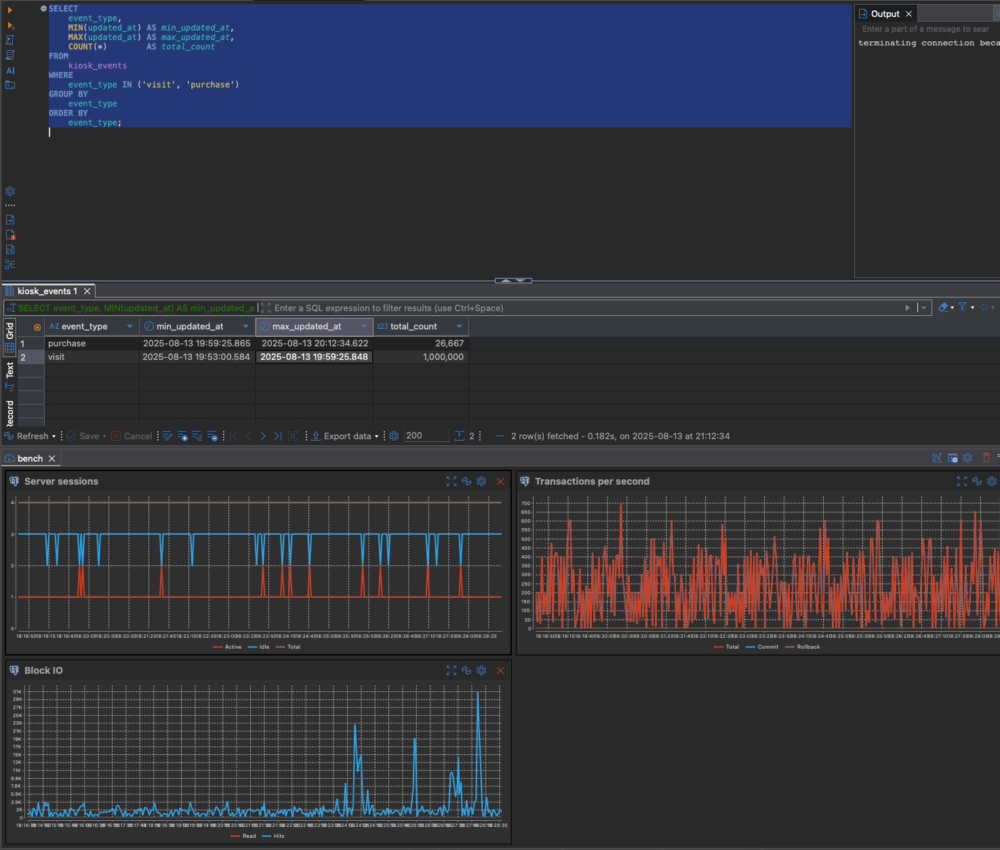

# Resultados

Vou separar os resultados por teste, e cada teste terá um número de relevância de 0 a 10, onde 0 é irrelevante e 10 é extremamente relevante.

### Teste#001

```
Relevância: 0
Observações:
Sem paralelização, sem otimizações, sem ajustes de hardware, sem limitações de CPU e RAM. ( Usando Macbook M4 Max e 36GB RAM )
Só receber dados e inserir no banco de dados.

Resultados:
Inicio: 2025-08-12 18:46:53.835
Fim: 2025-08-12 18:54:02.651
Total processado: 1.000.000 eventos
Tempo total: 7 minutos
Média de mensagens por segundo: 2.380,95 (1.000.000 eventos / 420 segundos)
Média de tempo por mensagem: 0,42 ms (420 segundos / 1.000.000 eventos)
```

### Teste#002

```
Relevância: 2
Observações:
Sem paralelização, sem otimizações, sem ajustes de hardware, com limitações de 2 CPUs e 2 GB de RAM.
ainda faltam 600.000 eventos, e ja acumula um pouco mais de 900.000 eventos no banco de dados.

Resultados:
Inicio: 2025-08-13 17:30:44.958
Fim: 2025-08-13 18:00:23.154
Total processado: 400.000 eventos
Tempo total: 29 minutos
Média de mensagens por segundo: 229,41 (400.000 eventos / 1.742 segundos)
Média de tempo por mensagem: 4,31 ms (1.742 segundos / 400.000 eventos)
```

### Teste#003

Até agora, eu tinha 1 partição, 1 consumer, e 1 producer. 

Me questiono: Aumentar partições para 12 ajuda em que ? Nada! Só se eu tivesse mais consumers.

Neste momento, vamos fazer duas otimizações:
1. Aumentar o tamanho do lote de mensagens para 2000.
2. Mudar o tipo de compressão do tópico de `none` para `gzip`.
3. Usar thread pool no producer para enviar mensagens em paralelo. ( Não tem a ver com consumer em si )

Não estamos preocupado neste momento com tamanho de mensagem, apenas com o fluxo, que não está levando a CPU acima de 20% ( Mesmo com limitação ).

Uma das otimizações é mudar o compression.type do tópido de `none` por (lz4)[https://stackoverflow.com/questions/67537111/how-do-i-decide-between-lz4-and-snappy-compression] para ganhar performance de descompressão.

Já que no Karafka, (o default é none)[https://karafka.io/docs/Librdkafka-Configuration/#global-configuration-properties].

| Property | Required | Valid Values | Default | Priority | Description |
|----------|----------|--------------|---------|----------|-------------|
| compression.type | P | none, gzip, snappy, lz4, zstd | none | medium | Alias for compression.codec: compression codec to use for compressing message sets. This is the default value for all topics, may be overridden by the topic configuration property compression.codec. Type: enum value |

A parte do thread pool é interessante, pois ele tava fazendo flush por cada messagem enviada, e no fim, eu tinha picos baixos de CPU, por que as mensagens não tinha sido commited ainda. 

Então eu tinha mais tempo ocioso, e o teste precisa ter em conta que tenho 1 milhão de mensagem pendente.

```bash
[2025-08-13T19:22:16.573964638] Starting to produce 1000000 messages to topic: jobs
[2025-08-13T19:22:40.645495927] Finished producing 1000000 messages with flush in 0ms
```

Essa mudança no producer é loucura, de tão rápido.

```
Relevância: 8
Observações:

Resultados:
Inicio: 2025-08-13 19:22:17.361
Fim: 2025-08-13 19:29:15.891
Total processado: 1.000.000 eventos
Tempo total: 6 minutos
Média de mensagens por segundo: 2.777,78 (1.000.000 eventos / 360 segundos)
Média de tempo por mensagem: 0,36 ms (360 segundos / 1.000.000 eventos)
```

### Teste#004

A mudança brusca do Teste#003 me fez questionar uma coisa:

Será que eu perco performance se eu estou fazendo leitura e escrita na mesma partição ?

Então preciso ao mesmo tempo escrever de forma contínua, como se além dos 1 milhão, eu continuasse recebendo eventos.


```
Relevância: 8
Observações:
Aparentemente, o resultado é o mesmo. o pull vai ser menor, por que eu pego exatamente o que está disponível na partição.

Resultados:
Inicio: 2025-08-13 19:53:00.584
Fim: 2025-08-13 19:59:25.848
Total processado: 1.000.000 eventos
Tempo total: 6 minutos
Média de mensagens por segundo: 2.777,78 (1.000.000 eventos / 360 segundos)
Média de tempo por mensagem:  0,36 ms (360 segundos / 1.000.000 eventos)
```



### Teste#005

O resultado do Teste#003, e o Teste#004, sem precisar de otimizar o consumer, me faz pensar que está muito fácil.

Vamos começar a apertar: Nosso Workload agora é 25 milhões de eventos presos, enquanto recebemos 100 mil eventos por minuto.

Não vamos alterar nada no nosso consumer, nem no Ruby/Rails

Para processar tudo, vamos precisar (talvez) de 250 minutos, ou seja, 4 horas e 10 minutos.

Porém, nosso problema é que após a cada 10 minutos, temos 1 milhão de eventos novos.

```
Relevância: 9
Observações:
Não vamos consegui processar tudo.

Resultados:
Inicio: 2025-08-13 20:59:21.466
Fim: 2025-08-13 21:57:08.273
Total processado: 9346175
Tempo total: 55 minutos
Média de mensagens por segundo: 2.722,22 (8.957.612 eventos / 3.290 segundos)
Média de tempo por mensagem: 0,37 ms (3.290 segundos / 8.957.612 eventos)
Lag: 21.376.000 Eventos
```

### Teste#006

O Teste#005 mostrou que o sistema é capaz de lidar com uma carga de 100 mil eventos por minuto, mas o lag acumulado é significativo.

Antes de otimizar o consumer, a seguinte pergunta surge: Se não fosse pelos 25 milhões de eventos iniciais, o sistema teria conseguido processar tudo?

é o que vamos testar agora.

Para testar isso, eu preciso adicionar uma label para cada 100 mil eventos, para calcular o tempo de processamento de cada lote.

Resultados:

```bash
SELECT
    event_type,
    MIN(updated_at) AS min_updated_at,
    MAX(updated_at) AS max_updated_at,
    COUNT(*)        AS processados,
    MAX(updated_at) - MIN(updated_at) AS tempo_total
FROM
    kiosk_events
GROUP BY
    event_type
ORDER BY
    event_type;

event_type |min_updated_at         |max_updated_at         |processados|tempo_total    |
-----------+-----------------------+-----------------------+-----------+---------------+
purchase-0 |2025-08-13 22:09:50.646|2025-08-13 22:10:34.113|     100000|00:00:43.466403|
purchase-1 |2025-08-13 22:10:51.020|2025-08-13 22:11:34.565|     100000|00:00:43.544496|
purchase-2 |2025-08-13 22:11:51.254|2025-08-13 22:12:31.289|     100000|00:00:40.034331|
purchase-3 |2025-08-13 22:12:51.415|2025-08-13 22:13:33.654|     100000|00:00:42.238269|
purchase-4 |2025-08-13 22:13:51.590|2025-08-13 22:14:31.940|     100000|00:00:40.350253|
purchase-5 |2025-08-13 22:14:51.780|2025-08-13 22:15:31.605|     100000| 00:00:39.82562|
purchase-6 |2025-08-13 22:15:51.957|2025-08-13 22:16:32.663|     100000|00:00:40.706467|
purchase-7 |2025-08-13 22:16:52.130|2025-08-13 22:17:32.717|     100000|00:00:40.587259|
purchase-8 |2025-08-13 22:17:52.304|2025-08-13 22:18:32.061|     100000|00:00:39.756939|
purchase-9 |2025-08-13 22:18:52.515|2025-08-13 22:19:33.330|     100000| 00:00:40.81528|
```

Então, sem alterar o consumer, o ruby, ou adicionar paralelização, o sistema é capaz de processar 100 mil eventos em cerca de 40 a 43 segundos.

O problema então, será o que fazer com os 25 milhões de eventos iniciais, que acumulam um lag significativo.

### Teste#007

O Teste#006 mostrou que o sistema é capaz de processar 100 mil eventos em cerca de 40 a 43 segundos, mas o lag acumulado dos 25 milhões de eventos iniciais ainda é um desafio.

Como escalar e otimizar o processamento para lidar com esse lag?

O truffleRuby é uma péssima opção, por que ele não vai conseguir lidar com o import do .jar do Kafka, nem se isolar o o consumer como eu fiz com o JRuby. 
What a Shame! Não tem nem como testar, pelos menos por enquanto.

Vamos então ao JRuby vs Ruby MRI. ( eu usei uma imagem custom, então se vc for rodar, vai quebrar, precisa ir lá no repo e buildar local https://github.com/alexcastrodev/truffleruby)

Por problema de compatibilidade com ActiveRecord, Rails (Rails 7.x tem que usar o JRuby 9, e Rails 8.x tem que usar o JRuby 10), e falta de suporte com kafrafka, o container do JRuby foi isolado.

O que é uma péssima experiência, por que não conseguimos reaproveitar o código do Rails.

O TruffleRuby conseguiu dar start no projeto inteiro, só deu incompatibilidade com o karafka, e precisei fazer monkey pathing no GC.

O JRuby debaixo da JVM ainda apanhou muito com a performance atual do MRI.

```
event_type      |min_updated_at         |max_updated_at         |processados|tempo_total    |
----------------+-----------------------+-----------------------+-----------+---------------+
jruby-purchase-1|2025-08-14 21:27:29.025|2025-08-14 21:28:41.244|     100000|00:01:12.218403|
jruby-purchase-3|2025-08-14 21:28:41.653|2025-08-14 21:29:29.930|     100000|00:00:48.277596|
ruby-purchase-0 |2025-08-14 21:27:14.845|2025-08-14 21:28:08.623|     100000|00:00:53.778087|
ruby-purchase-2 |2025-08-14 21:28:08.624|2025-08-14 21:28:59.769|     100000|00:00:51.145386|
```

O que me deu vontade de diminuir o POLL_MS do consumer, para 50ms, e aumentar o BATCH_SIZE para 5000.

Independentemente, o resultado parece o mesmo que antes.

```
event_type      |min_updated_at         |max_updated_at         |processados|tempo_total    |
----------------+-----------------------+-----------------------+-----------+---------------+
jruby-purchase-1|2025-08-14 21:37:35.448|2025-08-14 21:38:50.453|     100000|00:01:15.004774|
jruby-purchase-3|2025-08-14 21:38:50.453|2025-08-14 21:39:58.842|     100000|00:01:08.389332|
jruby-purchase-4|2025-08-14 21:39:58.842|2025-08-14 21:40:47.313|     100000|00:00:48.470891|
ruby-purchase-0 |2025-08-14 21:37:23.067|2025-08-14 21:38:12.837|     100000|00:00:49.770411|
ruby-purchase-2 |2025-08-14 21:38:12.838|2025-08-14 21:39:00.234|     100000|00:00:47.396155|
ruby-purchase-5 |2025-08-14 21:39:00.234|2025-08-14 21:39:48.822|     100000|00:00:48.587377|
```

Será que temos algum ganho com pequenos lotes de mensagens?

```
event_type      |min_updated_at         |max_updated_at         |processados|tempo_total    |
----------------+-----------------------+-----------------------+-----------+---------------+
jruby-purchase-1|2025-08-14 21:43:08.540|2025-08-14 21:44:30.431|     100000|00:01:21.890515|
jruby-purchase-3|2025-08-14 21:44:30.431|2025-08-14 21:45:39.355|     100000|00:01:08.923651|
jruby-purchase-4|2025-08-14 21:45:39.355|2025-08-14 21:46:31.286|     100000|00:00:51.931553|
ruby-purchase-0 |2025-08-14 21:42:58.138|2025-08-14 21:43:47.937|     100000|00:00:49.799054|
ruby-purchase-2 |2025-08-14 21:43:47.938|2025-08-14 21:44:36.894|     100000|00:00:48.956371|
ruby-purchase-5 |2025-08-14 21:44:36.894|2025-08-14 21:45:26.153|     100000| 00:00:49.25889|
```

Infelizmente, não conseguimos ter ganho algum, e mesmo que conseguíssemos, o ganho seria mínimo e não justificaria a complexidade adicional.

Escrever em Java faria mais sentido, mas o objetivo neste teste em específico é comparar Ruby e JRuby.

A performance aqui só vai começar a valer quando fizermos insert em massa, e não por mensagem.

```
event_type      |min_updated_at         |max_updated_at         |processados|tempo_total    |
----------------+-----------------------+-----------------------+-----------+---------------+
jruby-purchase-1|2025-08-14 21:55:47.571|2025-08-14 21:55:53.691|     100000|00:00:06.120578|
jruby-purchase-3|2025-08-14 21:56:07.780|2025-08-14 21:56:12.756|     100000| 00:00:04.97597|
ruby-purchase-0 |2025-08-14 21:55:37.125|2025-08-14 21:55:42.488|     100000|00:00:05.362195|
ruby-purchase-2 |2025-08-14 21:55:57.695|2025-08-14 21:56:02.632|     100000|00:00:04.936878|
```

Mas novamente, escrever um Ruby sem aproveitar do Rails, não faz sentido.

Então, ao dia de hoje, eu descarto o TruffleRuby e o JRuby para este tipo de teste, e vou focar no MRI.

### Teste#008

Com base que não vamos tocar no consumer, uma das formas que podemos melhorar a performance é aumentar o número de workers, e o número de partições para paralelizar o processamento.

Vamos analisar o cenário que temos 25 milhões de eventos, e estamos recebendo 100 mil eventos por minuto.

O primeiro teste que vamos fazer, é manter o batch size em 2000, e aumentar o número de partições para 12, e o número de workers para 6. ( Já que sabemos que esse tópico é o que pode inflar o lag )

Vamos analisar o resultado até o primeros 400 mil eventos após acumular 25 milhões de eventos.

```
event_type       |min_updated_at         |max_updated_at         |processados|tempo_total    |
-----------------+-----------------------+-----------------------+-----------+---------------+
ruby-purchase-250|2025-08-15 18:19:19.523|2025-08-15 18:21:03.090|     100000|00:01:43.567253|
ruby-purchase-251|2025-08-15 18:16:54.710|2025-08-15 18:18:41.775|     100000|00:01:47.065431|
ruby-purchase-252|2025-08-15 18:12:29.074|2025-08-15 18:13:50.541|     100000|00:01:21.467037|
ruby-purchase-253|2025-08-15 18:19:12.868|2025-08-15 18:20:20.158|     100000|00:01:07.289736|
ruby-purchase-254|2025-08-15 18:24:17.187|2025-08-15 18:25:19.861|     100000|00:01:02.673812|
ruby-purchase-255|2025-08-15 18:21:37.297|2025-08-15 18:22:40.677|     100000|00:01:03.380015|
ruby-visit       |2025-08-15 17:33:10.118|2025-08-15 18:43:52.062|   25000000|01:10:41.944246|
----------------------------------------------------------------------------------------------
SEPARADOR
----------------------------------------------------------------------------------------------
primeiro               |ultimo                 |tempo_total    |
-----------------------+-----------------------+---------------+
2025-08-15 17:33:10.118|2025-08-15 18:43:52.062|01:10:41.944246|
```

Processamos 25 milhões em cerca de 1 hora e 10 minutos, e o tempo médio por mensagem foi de 0,17 ms. Enquanto o tempo médio por lote foi de 1 minuto e 43 segundos.

Agora são 18:48, e então desde o ultimo update no banco, acumulamos 500 mil eventos, pois passaram 5 minutos.

Então sabemos que em uma hora, com as limitações atuais, resolveriamos o problema de lag, e ainda processaríamos os eventos novos.

O segundo teste, é aumentar o número de partições para 24, e o número de workers para 12.

```
event_type       |min_updated_at         |max_updated_at         |processados|tempo_total    |
-----------------+-----------------------+-----------------------+-----------+---------------+
ruby-purchase-250|2025-08-15 19:27:32.878|2025-08-15 19:29:24.675|     100000|00:01:51.797211|
ruby-purchase-251|2025-08-15 19:46:48.304|2025-08-15 19:48:01.768|     100000|00:01:13.463983|
ruby-purchase-252|2025-08-15 19:29:33.487|2025-08-15 19:31:19.532|     100000|00:01:46.044973|
ruby-purchase-253|2025-08-15 19:32:56.442|2025-08-15 19:34:25.215|     100000|00:01:28.773695|
ruby-purchase-254|2025-08-15 19:20:45.002|2025-08-15 19:25:15.379|     100000|00:04:30.376931|
ruby-purchase-255|2025-08-15 19:46:00.058|2025-08-15 19:46:58.720|     100000|00:00:58.661412|
ruby-visit       |2025-08-15 18:55:26.117|2025-08-15 19:51:20.367|   25000000|00:55:54.250596|
----------------------------------------------------------------------------------------------
SEPARADOR
----------------------------------------------------------------------------------------------
primeiro               |ultimo                 |tempo_total    |
-----------------------+-----------------------+---------------+
2025-08-15 18:55:26.117|2025-08-15 19:51:20.367|00:55:54.250596|
```

Neste caso, processamos 25 milhões em cerca de 55 minutos, e o tempo médio por mensagem foi de 0,13 ms. Enquanto o tempo médio por lote foi de 1 minuto e 51 segundos.

Embora temos um ganho de 15 minutos, estamos considerando que estamos recebendo a mensagem e fazendo insert no banco de dados, em uma tabela sem indices, e sem otimizações.

Não estamos considerando também fazer bulk insert, ou usar COPY do Postgres, que poderia acelerar ainda mais o processo.

E por fim, o terceiro teste que repete as condições do segundo teste, mas com o batch size aumentado para 10_000.

```
event_type       |min_updated_at         |max_updated_at         |processados|tempo_total    |
-----------------+-----------------------+-----------------------+-----------+---------------+
ruby-purchase-250|2025-08-15 20:39:34.887|2025-08-15 20:41:29.521|     100000|00:01:54.633365|
ruby-purchase-251|2025-08-15 20:55:27.637|2025-08-15 20:56:58.429|     100000| 00:01:30.79272|
ruby-purchase-252|2025-08-15 20:41:42.592|2025-08-15 20:43:31.771|     100000|00:01:49.178584|
ruby-purchase-253|2025-08-15 20:44:57.307|2025-08-15 20:46:35.072|     100000|00:01:37.764596|
ruby-purchase-254|2025-08-15 20:34:00.253|2025-08-15 20:38:38.456|     100000|00:04:38.202891|
ruby-purchase-255|2025-08-15 20:55:00.122|2025-08-15 20:56:02.344|     100000|00:01:02.222142|
ruby-visit       |2025-08-15 20:07:40.972|2025-08-15 21:00:22.994|   25000000|00:52:42.021869|
----------------------------------------------------------------------------------------------
SEPARADOR
----------------------------------------------------------------------------------------------
primeiro               |ultimo                 |tempo_total    |
-----------------------+-----------------------+---------------+
2025-08-15 20:07:40.972|2025-08-15 21:00:22.994|00:52:42.021869|
```

Neste caso, processamos 25 milhões em cerca de 52 minutos, e o tempo médio por mensagem foi de 0,11 ms. Enquanto o tempo médio por lote foi de 1 minuto e 54 segundos.

# Teste#009

Lendo um dos papers do [TruffleRuby](https://ssw.jku.at/General/Staff/Daloze/thread-safe-collections.pdf), tive um insight interessante, por que eles conseguiram 15.5x mais performance que o MRI, e 1.9x mais que o JRuby usando 8 threads.

E então pensei em voltar a usar o TruffleRuby, mas com uma abordagem diferente.

Usando apenas gem com extensões nativas em C, e sem usar o Rails.

Ao usar o ActiveRecord com pool de conexões, o TruffleRuby conseguiu o mesmo resultado que o MRI, em questão de tempo.

```
event_type               |min_updated_at         |max_updated_at         |processados|tempo_total    |
-------------------------+-----------------------+-----------------------+-----------+---------------+
truffleruby_ar_purchase-0|2025-08-19 15:09:32.000|2025-08-19 15:10:26.000|     100000|       00:00:54|
truffleruby_ar_purchase-1|2025-08-19 15:10:26.000|2025-08-19 15:11:13.000|     100000|       00:00:47|
truffleruby_ar_purchase-2|2025-08-19 15:11:13.000|2025-08-19 15:11:59.000|     100000|       00:00:46|
truffleruby_ar_purchase-3|2025-08-19 15:11:59.000|2025-08-19 15:12:46.000|     100000|       00:00:47|
truffleruby_ar_purchase-4|2025-08-19 15:12:46.000|2025-08-19 15:13:33.000|     100000|       00:00:47|
truffleruby_ar_purchase-5|2025-08-19 15:13:33.000|2025-08-19 15:14:20.501|     100000|00:00:47.501605|
```

Isso me leva ao motivo dos callbacks do ActiveRecord serem tão lentos, e o por que o TruffleRuby não conseguiu ter um ganho de performance significativo.

Sem callbacks, o resultado foi o seguinte:

```
event_type               |min_updated_at         |max_updated_at         |processados|tempo_total|
-------------------------+-----------------------+-----------------------+-----------+-----------+
truffleruby_ar_purchase-0|2025-08-19 14:51:39.000|2025-08-19 14:52:12.000|     100000|   00:00:33|
truffleruby_ar_purchase-1|2025-08-19 14:52:12.000|2025-08-19 14:52:38.000|     100000|   00:00:26|
truffleruby_ar_purchase-2|2025-08-19 14:52:38.000|2025-08-19 14:53:04.000|     100000|   00:00:26|
truffleruby_ar_purchase-3|2025-08-19 14:53:04.000|2025-08-19 14:53:29.000|     100000|   00:00:25|
truffleruby_ar_purchase-4|2025-08-19 14:53:29.000|2025-08-19 14:53:54.000|     100000|   00:00:25|
truffleruby_ar_purchase-5|2025-08-19 14:53:54.000|2025-08-19 14:54:19.000|     100000|   00:00:25|
```

Isso me intrigou um pouco, por que a passagem pelos callbacks faz cada insert demorar o dobro do tempo.

Já que não estamos usando callbacks, e se usarmos direto o PG?

Vamos fazer o mesmo teste, mas usando o TruffleRuby com o PG puro, sem ActiveRecord:

Resultado:

```
event_type               |min_updated_at         |max_updated_at         |processados|tempo_total|
-------------------------+-----------------------+-----------------------+-----------+-----------+
truffleruby_pg_purchase-0|2025-08-19 14:39:29.000|2025-08-19 14:39:55.000|     100000|   00:00:26|
truffleruby_pg_purchase-1|2025-08-19 14:39:55.000|2025-08-19 14:40:20.000|     100000|   00:00:25|
truffleruby_pg_purchase-2|2025-08-19 14:40:20.000|2025-08-19 14:40:45.000|     100000|   00:00:25|
truffleruby_pg_purchase-3|2025-08-19 14:40:45.000|2025-08-19 14:41:12.000|     100000|   00:00:27|
truffleruby_pg_purchase-4|2025-08-19 14:41:12.000|2025-08-19 14:41:43.000|     100000|   00:00:31|
truffleruby_pg_purchase-5|2025-08-19 14:41:43.000|2025-08-19 14:42:08.000|     100000|   00:00:25|
```

Então, o TruffleRuby conseguiu fazer o insert no banco de dados em cerca de 25 segundos, enquanto o MRI levou cerca de 45 segundos. O que me leva a crer que o gargalo no MRI é o ActiveRecord, e não o CRuby em si.

Vamos testar a mesma operação, usando a mesma abordagem do TruffleRuby, mas com o MRI.

```
event_type        |min_updated_at         |max_updated_at         |processados|tempo_total|
------------------+-----------------------+-----------------------+-----------+-----------+
mri_pg_purchase-1|2025-08-19 17:56:27.000|2025-08-19 17:56:44.000|     100000|   00:00:17|
mri_pg_purchase-2|2025-08-19 17:56:44.000|2025-08-19 17:56:59.000|     100000|   00:00:15|
mri_pg_purchase-3|2025-08-19 17:56:59.000|2025-08-19 17:57:15.000|     100000|   00:00:16|
mri_pg_purchase-4|2025-08-19 17:57:15.000|2025-08-19 17:57:32.000|     100000|   00:00:17|
mri_pg_visit     |2025-08-19 17:53:43.000|2025-08-19 17:56:27.000|    1000000|   00:02:44|
```

O MRI foi ainda mais rápido, e então vemos que o ActiveRecord está sendo um gargalo por enquanto.

Será que podemos ter ganho de performance com o ActiveRecord?

Ao fazer skip de validações, callbacks, e usar o `insert_all` do ActiveRecord, conseguimos o seguinte resultado:

```
event_type       |min_updated_at         |max_updated_at         |processados|tempo_total|
-----------------+-----------------------+-----------------------+-----------+-----------+
mri_pg_purchase-0|2025-08-19 15:35:50.000|2025-08-19 15:36:05.000|     100000|   00:00:15|
mri_pg_purchase-1|2025-08-19 15:36:05.000|2025-08-19 15:36:22.000|     100000|   00:00:17|
mri_pg_purchase-2|2025-08-19 15:36:22.000|2025-08-19 15:36:38.000|     100000|   00:00:16|
mri_pg_purchase-3|2025-08-19 15:36:38.000|2025-08-19 15:36:53.000|     100000|   00:00:15|
mri_pg_purchase-4|2025-08-19 15:36:53.000|2025-08-19 15:37:10.000|     100000|   00:00:17|
mri_pg_purchase-5|2025-08-19 15:37:10.000|2025-08-19 15:37:26.000|     100000|   00:00:16|
```

Eu fiz um comparativo com o Ruby MRI 3.4.5 que traz melhorias em performance em ARM e x64, mas o resultado foi semelhante:

```
event_type       |min_updated_at         |max_updated_at         |processados|tempo_total|
-----------------+-----------------------+-----------------------+-----------+-----------+
mri_pg_purchase-0|2025-08-19 15:39:26.000|2025-08-19 15:39:41.000|     100000|   00:00:15|
mri_pg_purchase-1|2025-08-19 15:39:41.000|2025-08-19 15:39:58.000|     100000|   00:00:17|
mri_pg_purchase-2|2025-08-19 15:39:58.000|2025-08-19 15:40:14.000|     100000|   00:00:16|
mri_pg_purchase-3|2025-08-19 15:40:14.000|2025-08-19 15:40:30.000|     100000|   00:00:16|
mri_pg_purchase-4|2025-08-19 15:40:30.000|2025-08-19 15:40:47.000|     100000|   00:00:17|
mri_pg_purchase-5|2025-08-19 15:40:47.000|2025-08-19 15:41:04.000|     100000|   00:00:17|
```

Em resumo:

TruffleRuby sem ActiveRecord: 25 segundos para 100 mil eventos.
TruffleRuby com ActiveRecord: 54 segundos para 100 mil eventos.
MRI sem ActiveRecord: 15 segundos para 100 mil eventos.
MRI com ActiveRecord(callbacks): 45 segundos para 100 mil eventos.
MRI 3.4.5 com ActiveRecord: 15 segundos para 100 mil eventos.


# Test#010

Esse report agora incluimos o .NET

Usando a mesma abordagem do TruffleRuby / MRI, mas agora com o .NET, conseguimos o seguinte resultado:

```
event_type       |min_updated_at         |max_updated_at         |processados|tempo_total    |
-----------------+-----------------------+-----------------------+-----------+---------------+
dotnet_purchase-1|2025-08-19 17:36:50.767|2025-08-19 17:37:13.807|     100000|00:00:23.040179|
dotnet_purchase-2|2025-08-19 17:37:13.380|2025-08-19 17:37:34.544|     100000|00:00:21.163883|
dotnet_purchase-3|2025-08-19 17:37:34.101|2025-08-19 17:37:55.419|     100000|00:00:21.317306|
dotnet_purchase-4|2025-08-19 17:37:54.970|2025-08-19 17:38:15.402|     100000|00:00:20.431834|
dotnet_purchase-5|2025-08-19 17:38:14.936|2025-08-19 17:38:36.378|     100000|00:00:21.442204|
dotnet_purchase-6|2025-08-19 17:38:35.892|2025-08-19 17:38:57.337|     100000|00:00:21.444979|
dotnet_purchase-7|2025-08-19 17:38:56.897|2025-08-19 17:39:17.549|     100000| 00:00:20.65242|
```

O .NET conseguiu fazer o insert no banco de dados em cerca de 20 a 23 segundos, o que é um resultado muito bom.
